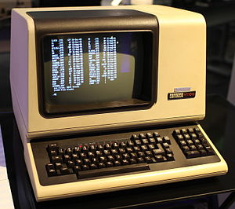

import { Head } from 'mdx-deck'
const BS = ()=>"\\";
export { default as theme } from './theme'


<Head>
  <title>Presentation Title</title>
</Head>

# HackingTheTerminal 
## Escape Codes to Animate your Terminal 

```json
{
  "Speaker": "Gaetano Checinski",
  "Company": "LoopPerfect"
  "Role": "Founder & Software Architect"
}
```

---

## Reactive Terminal


---

# How ?

## Escape Sequences + FP = Magic


---

<h1> <BS/>e[Escape Sequences </h1>

- Colors & Style
- Moving The Cursor
- Deletions

---

<h1> <BS/>e[Escape Sequences</h1>

<span>"<b>\e[</b>CODE" general shape</span>
<br/>
<br/>
<span>"<b>\e[0m</b>" default style</span>
<br/>
<br/>
<span>Terminal is Stateful </span>

---

# Colors

<h2>
<b>\e[31m</b>
<span style={{color:"red"}}> red text </span> 
<b>\e[43m</b> 
<span style={{color: "red", background:"yellow"}}> and yellow background </span>
</h2>

---

# Colors & Styles Combined


<h2> 
<b><BS/>e[5;43;31m</b> <blink style={{background:"yellow",color:"red"}}> blinking text</blink>
</h2>

---

# Moving the Cursor

<b><BS/>e[</b><i>n</i><b>A</b> move n up

<b><BS/>e[</b><i>n</i><b>B</b> move n down

<b><BS/>e[</b><i>n</i><b>C</b> move n right

<b><BS/>e[</b><i>n</i><b>D</b> move n left

---

# Example

<h2>123456<BS/>e[4DXX<BS/>e[1A<BS/>e[2DYY<b><BS/>e[</b>1B</h2>

---

# Terminal is Stateful!

---

# You should describe what you want
## not how to get there

---

# Solution

<div style={{display:"flex", height:"50vh", justifyContent:"center", alignItems:"center"}}>


</div>
 
---

# Example using RxTerm

```c++
  VirtualTerminal vt;

  auto superProgressBar = [](auto x, auto y, auto z) -> FlowLayout<> {
    return {
      Text("3 segment progressbar: "),
      {
        MaxWidth(20, Progress(x)),
        MaxWidth(20, Progress(y)),
        MaxWidth(20, Progress(z))
      }
    };
  };

  for (int i = 0; i < 101; ++i) {
    vt = renderToTerm(vt, superProgressBar(0.01 * i, 0.02 * i, 0.03 * i));
    std::this_thread::sleep_for(200ms);
  }
```

---

# If Love Observables

```cpp

using rxo = rxcpp::observable<>;

rxo::zip_with_latest(
  superProgressBar,
  rxo::interval(100ms),
  rxo::interval(200ms),
  rxo::interval(300ms))
.scan(VirtualTerminal{}, renderToTerm)
.subscribe();

```

---

# Support

---

# Linux & Mac


---

# VT100 (since 1978)



---

# Windows 10 (since June 2018)


---

# Questions & Further Links

<https://buckaroo.pm>

<https://github.com/LoopPerfect/rxterm>

<http://wiki.bash-hackers.org/scripting/terminalcodes>

<https://hackernoon.com/building-reactive-terminal-interfaces-in-c-d392ce34e649>

